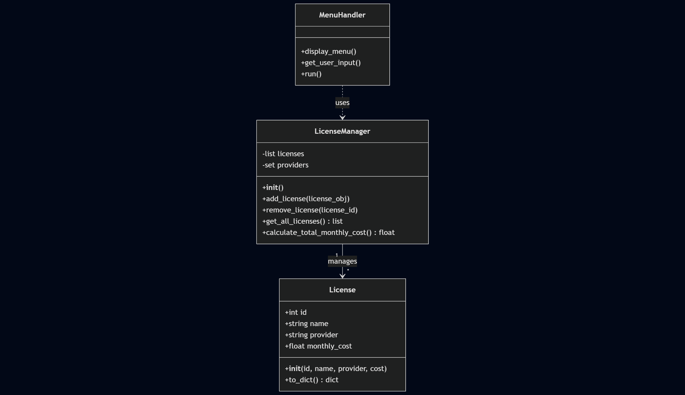

# SaaS License Management System

A professional, modular Python-based management system designed to track SaaS licenses, costs, and providers. This project demonstrates advanced data structures, OOP principles, and clean code standards (PEP 8).

## 🛠️ Features
- **Full CRUD Operations**: Create, Read, Search, Update, and Delete software licenses.
- **Persistent Storage**: Data is saved and loaded from a JSON database.
- **Advanced Analytics**: Real-time statistics, cost tracking, and provider filtering.
- **Optimized Performance**: Uses `collections.Counter` for O(1) provider tracking.
- **Robust UI**: Interactive console menu with full input validation and error handling.

## 🚀 Quick Start Guide

### Prerequisites
- **Python 3.10** or higher installed on your system.
- **Git** (optional, for cloning).

### Installation
1. **Clone the repository**:
   ```bash
   git clone https://github.com/your-username/saas-license-manager.git
   cd saas-license-manager
   ```

2. **(Optional) Generate synthetic data**:
   If you want to test the system with 1,000 sample records:
   ```bash
   python3 -m utils.data_generator
   ```

### How to Run
To start the interactive management system, simply run:
```bash
python3 main.py
```

## 📂 Project Structure
```text
python_sence_ABP3/
│
├── main.py                 # Entry point and User Interface (MenuHandler)
├── core/                   # Business logic (The "Engine")
│   ├── __init__.py
│   ├── manager.py          # LicenseManager class (CRUD & Logic)
│   └── models.py           # License class (Data Model)
├── utils/                  # Helper tools
│   ├── __init__.py
│   └── data_generator.py   # Synthetic data generation script
├── data/                   # Persistent storage
│   └── licenses.json       # JSON database
├── doc/                    # Project documentation
│   ├── classdiagram.png    # UML Class Diagram
│   └── ROADMAP.md          # Project development phases
├── .gitignore              # Git ignore rules
└── README.md               # Project documentation
```

## 🧠 Technical Highlights
- **Encapsulation**: Used `@property` decorators for clean data access.
- **Efficiency**: Implemented incremental updates for provider sets to avoid O(n) recalculations.
- **Modularity**: Strict separation between data models, business logic, and UI.

## 📊 Documentation


## 👤 Author
Aníbal Rojo
